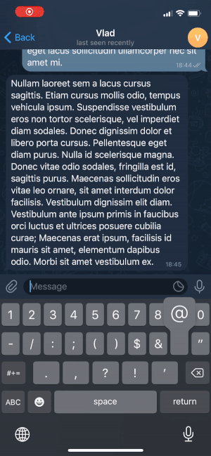
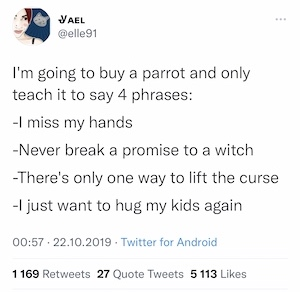
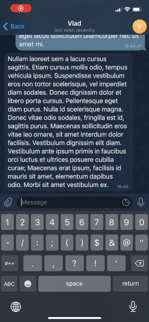

# @twt_2_tg_bot
Telegram bot that zhuzh shared Twitter content

## Video and image converter

Telegram doesn't provide the ability to play Twitter videos inside the app. The bot converts them to regular MP4 files. The bot allows to download images from a tweet.

## Thread converter

The bot allows to unroll threads.

> Only text replies are supported for now

## Text converter

Some tweets may contain line breaks or even dialogs.

Such tweets are barely readable in Telegram. The bot keeps original formatting.

> This feature is outdated because Telegram fixed their previews

## Dependencies

* [teloxide](https://github.com/teloxide/teloxide)
* [egg-mode](https://github.com/egg-mode-rs/egg-mode)